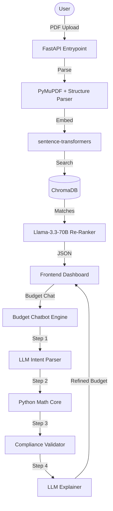

# ⬡ ImpactLink: AI Grant Engineering Platform

**ImpactLink** is a production-grade AI platform designed to automate the grant lifecycle for NGOs. This repository demonstrates sophisticated **Agentic Workflows**, **Hybrid Intelligence (LLM + Deterministic Logic)**, and a custom **RAG (Retrieval-Augmented Generation) Pipeline**.

---

## 🚀 Key Technical Highlights (AI Engineering)

### 1. Hybrid Intelligence Budget Engine
Most AI apps let the LLM guess numbers. ImpactLink uses a **4-stage deterministic pipeline** to ensure legal compliance (e.g., minimum wage laws, indirect cost caps):
- **Stage 1 (Intent Extraction):** LLM parses natural language into a structured `BudgetEditCommand` (JSON).
- **Stage 2 (Python Execution):** A deterministic Python engine applies the edit and rebalances the budget using algebraic constraints.
- **Stage 3 (Validation/Auto-Correction):** A validation layer enforces hard constraints (Wage floors from `minimum_wage.json`, Grant caps).
- **Stage 4 (Natural Language Explanation):** An LLM synthesizes the delta between the requested change and the legal correction into a user-friendly explanation.

### 2. Multi-Agent Proposal Ecosystem
Uses a specialized agentic architecture for different writing tasks:
- **Streaming Draft Agent:** Implements **Server-Sent Events (SSE)** to stream deep-researched, funder-specific proposals in real-time.
- **Guided Build Agent:** A stateful "Interviewer" agent that uses structured output to guide non-technical users through proposal development.
- **Scoring Agent:** A multi-dimensional evaluator that uses LLM-as-a-judge to grade proposals against 6 grant-readiness metrics.

### 3. RAG & Semantic Discovery
- **Vector Pipeline:** Custom RAG implementation using `MiniLM-L6-v2` embeddings stored in **ChromaDB**.
- **Agentic Re-Ranking:** Initial vector retrieval is followed by a "Reasoning Pass" where Llama 3.3 70B re-evaluates the top candidates and provides a "Match Justification" for the user.
- **Cross-Organization Similarity:** An in-memory mission matching system to find NGO collaborators based on mission-statement vector similarity.

---

## 🛠️ Stack & Infrastructure

- **LLM Context:** Llama 3.3 70B (Versatile) via **Groq LPU Inference Engine** (~300 tokens/sec).
- **Orchestration:** LangChain (Structured Output, ChatPromptTemplates, SSE Streaming).
- **Backend:** FastAPI (Async concurrency) + Pydantic (Strong type safety and validation).
- **Vector DB:** ChromaDB (Persistence for grant database).
- **Frontend:** React 18 + Custom Context Providers for AI State Management.

---

## 📁 System Architecture

---

## 🧬 Key Modules

| Module | Description | Technical Complexity |
|---|---|---|
| [`services/budget/`](file:./services/budget/) | Full accounting-grade budget engine | **High**: Implements FTE-based wage floor scaling and proportional rebalancing. |
| [`agents/draft_agent.py`](file:./agents/draft_agent.py) | SSE streaming proposal generator | **Medium**: Manages multi-section LLM context and formatting. |
| [`services/vector_store.py`](file:./services/vector_store.py) | RAG foundation | **Medium**: Wraps ChromaDB with metadata filtering and re-ranking logic. |
| [`services/budget_chatbot.py`](file:./services/budget_chatbot.py) | Logic-over-LLM chatbot | **High**: Rejects LLM number generation in favor of deterministic Python updates. |

---

## 📅 Roadmap & AI Evolution

- [ ] **Graph-Based RAG:** Transitioning from flat vector retrieval to Knowledge Graphs to map inter-funder relationships.
- [ ] **Recursive Self-Correction:** Implementing a loop where the Scoring Agent feeds feedback back into the Draft Agent for automated refinement.
- [ ] **LoRA Fine-tuning:** Training a small-scale model on NGO-specific grant language to reduce dependency on massive 70B models.

---

  <h3>ImpactLink: Engineering AI for Social Impact</h3>
  
<i>A project demonstrating how Agentic Workflows can solve high-stakes financial and organizational problems.</i>

