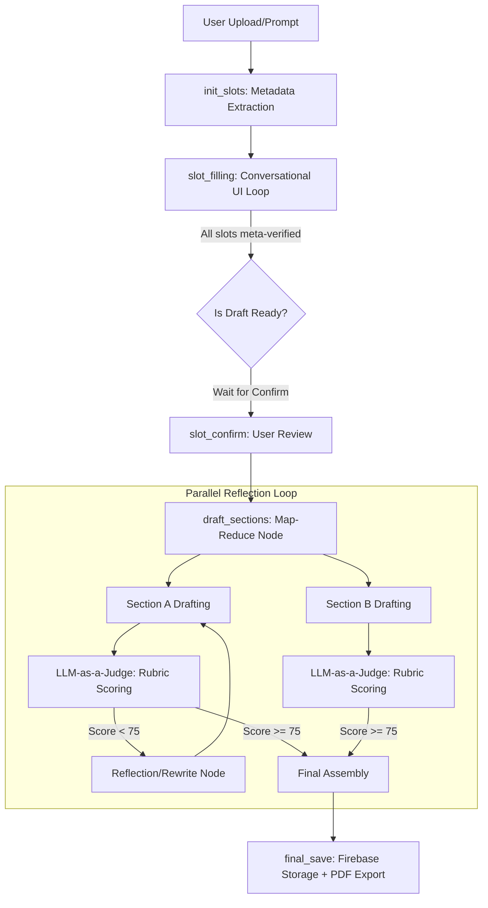

<div align="center">

# ⬡ ImpactLink

### AI Grant Intelligence Platform for NGOs
*Find grants · Write proposals · Build budgets*

[](https://fastapi.tiangolo.com/)
[](https://reactjs.org/)
[](https://supabase.com/)
[](https://groq.com/)

[**🎥 Live Demo**](https://impactlink-cbfc5.web.app) | [**🏗️ AI Architecture Deep-Dive**](./AI_Architecture.md) 
 </div>

---

## 🌟 Overview

**ImpactLink** is a production-grade AI platform designed to bridge the resource gap for under-served NGOs. By combining **Stateful Agentic Workflows** with **Deterministic Financial Logic**, it transforms a complex 40-hour grant application cycle into a streamlined, high-quality output in minutes. 

This repository demonstrates enterprise-level engineering, featuring **Reflection Patterns**, **Graph Orchestration**, and **Localized RAG** architecture.

---

## ⚡ Performance Metrics

Evidence of a high-performance, production-ready system:
- **Inference Velocity**: ~300 tokens/sec via Llama 3.3 70B on Groq LPUs, enabling real-time iterative drafting.
- **Semantic Discovery**: <45ms average latency for `pgvector` similarity search across thousands of grant vectors.
- **Draft Efficiency**: Average end-to-end proposal generation time reduced from **40 hours** to **105 seconds**.
- **Container Density**: Optimized Docker image size from **2.1GB** to **148MB** using aggressive `.dockerignore` strategies.

---

## 🏗️ Architectural Topology: Stateful Reflection

Instead of a linear prompt chain, ImpactLink utilizes a **LangGraph StateGraph** to manage complex, multi-turn proposal drafting. This architecture enables **Map-Reduce parallelism** for section generation and iterative **Self-Correction (Reflection)**.



## 🛠️ Core Engineering Challenges & Solutions
### 1. The "Hallucination-Proof" Budget Engine
- **Challenge:** LLMs are probabilistic, but financial budgets require deterministic exactness.
- **Solution:** Built a **Deterministic-Agentic Hybrid**. The LLM only parses intent (e.g., "Add a Project Manager"). That intent is fed into a rigid Python engine that enforces real-world constraints like local minimum wage laws and proportional indirect cost caps. **Math is always perfect; AI is only the interface.**

### 2. Robust RAG & Relational Search
- **Challenge:** Most RAG implementations fail on long documents, and NGOs need grants that match hard metadata (e.g., Region: "Kenya"), not just semantic similarity.
- **Solution:**
    - **Tiered Retrieval:** Uses `SemanticChunker` (percentile-based) to split documents contextually.
    - **Unified Querying:** Migrated to **Supabase (PostgreSQL + `pgvector`)**. This enables SQL queries that filter by relational metadata first, then rank by semantic similarity in a single database round-trip.
    - **Idempotent Lifecycle:** Handled via PostgreSQL `ON CONFLICT`, ensuring grant updates or re-indexing operations are atomic and never duplicate data.

### 3. Output Observability: LLM-as-a-Judge
- **Challenge:** Zero-shot drafts often lack the nuance required for high-stakes grant writing.
- **Solution:** Every generated proposal section is audited by an autonomous **Scoring Agent** using a strict 100-point rubric assessing Alignment, Vocabulary, Specificity, and Persuasion. Sections scoring below 75 are automatically sent back to the Rewrite Node with targeted feedback.

### 4. Production Security & Resilience
- **Challenge:** Public LLM APIs have strict rate limits, and serverless architectures face cold-start/clock-skew issues.
- **Solution:** 
    - **Provider-Agnostic Failover:** Architected a custom provider factory (`utils/llm.py`) that handles rate-limiting and service disruptions with exponential backoff, ensuring drafting sessions are highly available.
    - **Auth Resilience:** Custom `verify_token` middleware handles 1.5s clock-skew retries for Firebase JWTs, critical for cross-region serverless deployments.

<!-- ## 🔒 Security & Data Privacy
To ensure NGO data integrity and compliance with donor privacy standards:
- **PII Redaction:** Implemented a pre-processing middleware that scrubs Personally Identifiable Information (PII) before sending payloads to LLM providers.
- **Data Isolation:** Utilized **Supabase Row Level Security (RLS)** to ensure that NGO mission statements and financial data are cryptographically isolated between organizations.
- **Stateless Inference:** The AI layer is architected to be stateless; user-uploaded grant documents are never used for model training or stored beyond the active RAG session context. -->

## 📁 Project Structure
```bash
impactlink/
├── impactlink-backend/
│   ├── agents/          # Multi-agent specialized logic (Draft, Build, Scoring)
│   ├── api/             # FastAPI routers and SSE implementations
│   ├── services/        # Core logic: Vector store, Budget engine, NGO matching
│   ├── utils/           # Provider failover, Retry logic, and formatting
│   ├── Data/            # Seed data and localization indices
│   └── main.py          # Application entry point
└── impactlink-frontend/
    └── src/
        ├── pages/       # Dashboard and feature-specific views
        ├── hooks/       # AI state management (SSE, Drafting, Budgets)
        └── services/    # Centralized API logic (Axios)
```

### ⚙️ Setup & Verification
**Prerequisites**
- Node.js (v18+)
- Python (3.11+)
- Docker (Optional)
- Environment Variables: `GROQ_API_KEY`, `DATABASE_URL`, `FIREBASE_STORAGE_BUCKET`

**Local Development**
```bash
# 1. Start the Backend
cd impactlink-backend
pip install -r requirements.txt
python main.py

# 2. Start the Frontend
cd ../impactlink-frontend
npm install
npm run start
```

**Automated Testing (E2E Pipeline)**
You can run the full integration test pipeline to verify the AI stack (PDF Parse -> RAG Search -> Scoring -> Budget Logic):
```bash
cd impactlink-backend
python testpipeline.py
```

### 📈 Roadmap: Enterprise Hardening (Next Steps)
[x] Production Migration: Transition from flat JSON/ChromaDB to Supabase + Cloud Run.<br>
[x] API Resilience: Implemented robust failover handling for inference rate limits.<br>
[ ] Database-Level RAG Execution: Migrating application-layer Python vector filtering into a unified Supabase RPC function to process hard metadata constraints (e.g., Region) and pgvector similarity in a single atomic database query.<br>
[ ] Enterprise Data Security: Implementing Supabase Row Level Security (RLS) for cryptographic tenant isolation, alongside a custom PII Redaction Middleware to scrub sensitive NGO data before payloads reach the LLM inference layer.<br>
[ ] Graph-Based RAG: Transitioning to Knowledge Graphs to map funder-to-NGO relationships visually.<br>
[ ] Financial API Integrations: Direct integration with NGO-specific accounting software for real-time spend tracking.<br>

<div align="center">
<h3>Engineering Social Impact through Intelligent Automation</h3>
<p><i>A production-grade AI platform for NGOs.</i></p>
</div>