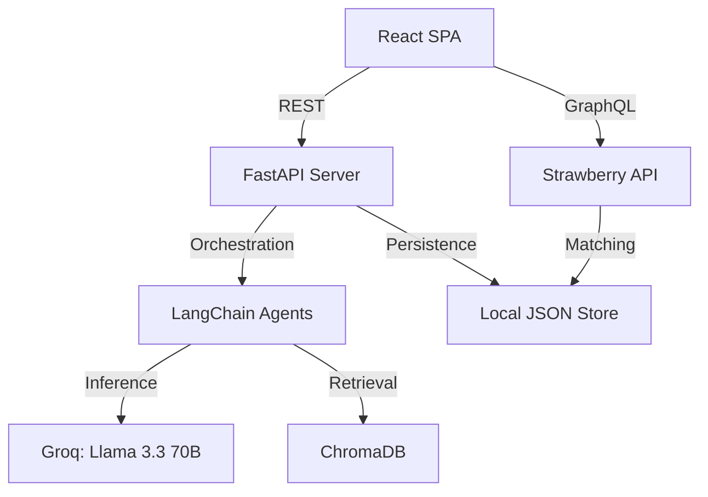

# ImpactLink Codebase Overview: Senior AI Architect Onboarding

Welcome to **ImpactLink**. This platform is designed to assist NGOs in navigating the grant funding landscape using Retrieval-Augmented Generation (RAG) and specialized AI agents.

## 1. Core Architecture
ImpactLink follows a **Modular Monolith** design with a clear separation between the AI orchestration layer and the web API.

- **Primary Pattern**: RAG (Retrieval-Augmented Generation).
- **Backend**: FastAPI serves as the primary REST entry point, while a secondary Strawberry GraphQL service handles NGO collaboration matching.
- **Frontend**: A React Single Page Application (SPA).
- **Data Layer**: Transitioning from local JSON file storage to a professional database (PostgreSQL on the roadmap). Vector data is persisted in **ChromaDB**.

### High-Level Data Flow

---

## 2. Entry Points

### Backend Execution
- **REST API**: [main.py](file:///c:/Users/aarus/Desktop/College/Projects/ImpactLink/main.py)
  - Operates on port `8000`.
  - Handles all core pipelines: upload, scoring, drafting, and building.
- **GraphQL API**: [graphql_server.py](file:///c:/Users/aarus/Desktop/College/Projects/ImpactLink/graphql_server.py)
  - Operates on port `8001`.
  - Specifically designed for NGO collaboration and relational matching.

### AI Pipelines
The main AI logic starts at these FastAPI endpoints:
1. **Grant Matching**: `POST /api/upload` (triggers parsing, embedding, and vector search).
2. **Proposal Drafting**: `POST /api/draft/stream` (SSE stream for multi-section proposal generation).
3. **Proposal Building**: `POST /api/build/stream` (Guided interview-style generation).

---

## 3. Tech Stack

| Category | Primary Library / Technology |
|---|---|
| **API Framework** | FastAPI, Uvicorn, Strawberry (GraphQL) |
| **LLM Orchestration** | LangChain (`langchain-groq`, `langchain-community`) |
| **Model Inference** | Llama 3.3 70B via Groq API |
| **Vector Database** | ChromaDB (Version >= 0.5.0) |
| **Embeddings** | `sentence-transformers` (**MiniLM-L6-v2**) |
| **Data Processing** | PyMuPDF (PDF parsing) |
| **Frontend** | React 18, React Router v6, Axios |

---

## 4. Project Structure (Functional Mapping)

### Backend Logic
- [agents/](file:///c:/Users/aarus/Desktop/College/Projects/ImpactLink/agents/): **Heart of the AI system.**
  - [draft_agent.py](file:///c:/Users/aarus/Desktop/College/Projects/ImpactLink/agents/draft_agent.py): Multi-section drafting with expert grant-writing prompts.
  - `build_agent.py`: Conversational proposal constructor.
  - `scoring_agent.py`: Evaluates proposal quality across multiple dimensions.
- [services/](file:///c:/Users/aarus/Desktop/College/Projects/ImpactLink/services/): **Infrastructure & Utilities.**
  - `vector_store.py`: ChromaDB integration and RAG pipeline.
  - `parser.py`: PDF-to-Structured-Proposal logic (utilizing PyMuPDF).
  - `ngo_store.py` / `work_store.py`: Local JSON persistence layer.

### Data & Resources
- [Data/](file:///c:/Users/aarus/Desktop/College/Projects/ImpactLink/Data/): Raw and enriched datasets (Grants, NGO profiles).
- [chroma_db/](file:///c:/Users/aarus/Desktop/College/Projects/ImpactLink/chroma_db/): Persistent local vector index.

### Frontend
- [impactlink-frontend/](file:///c:/Users/aarus/Desktop/College/Projects/ImpactLink/impactlink-frontend/): React source.
  - `src/pages/`: Feature-specific views (Dashboard, Draft Assistant, etc.).
  - `src/hooks/`: Business logic encapsulated in custom React hooks (SSE handling, API calls).

---

## 5. Strategic Context for AI Architects
- **SSE Integration**: Drafting and Building utilize Server-Sent Events (SSE) to provide a responsive, "typing" experience for long proposal sections.
- **Prompt Engineering**: Found in [agents/draft_agent.py](file:///c:/Users/aarus/Desktop/College/Projects/ImpactLink/agents/draft_agent.py), the master system prompts contain embedded expert grant-writing heuristics (equity lens, SMART objectives).
- **In-Memory Matching**: While grant search uses ChromaDB, NGO-to-NGO matching is currently handled with in-memory cosine similarity over JSON data (see [services/ngo_collab.py](file:///c:/Users/aarus/Desktop/College/Projects/ImpactLink/services/ngo_collab.py)), providing a lightweight alternative for smaller relational sets.
